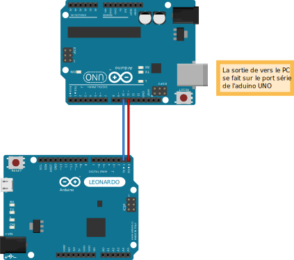

Semaine 1
=========

Présentation
------------

Dans cette semaine, nous nous intéressons à faire fonctionner la puce
*ESP8266* d'abord sur *arduino* pour bien comprendre son fonctionnement
avant de passer à la suite du projet.

Pour rappel : 

 - *arduino* permet un prototypage rapide de circuits électroniques et
   est programmable dans un langage très similaire à C.
 - *ESP8266* est une puce coûtant 3-4 euros permettant un accès wifi.
 

Un des problèmes est que pour s'assurer que la carte wifi fait ce qu'on 
attend d'elle, nous avons besoin d'une sortie de debug sur PC. Cependant,
elle utilise le port série de l'arduino et celui-là est déjà utilisé pour
la communication avec la carte. Nous devons donc passer par *SoftwareSerial*
qui nous donne la possibilité de faire une liaison série sur d'autres pins.

Nous utilisons un autre arduino pour faire le bridge, mais il aurait été tout
à fait possible d'utiliser un materiel comme *UartSBee v4* 
(http://www.seeedstudio.com/depot/UartSBee-V4-p-688.html)

Pour cela, nous réalisons **ArduinoSwitch** qui est un projet utilisant 
deux arduino : Un qui envoie en continu un flux d'information (simulation des
informations envoyées par la carte) et un qui est chargé de reçevoir ce flux
et l'envoyer sur le PC via le port série.

ArduinoSwitch
-------------

Nous réalisons le montage suivant :

	
	Dans ce montage, l'arduino LEONARDO envoie sur son port série (pins 1 et 0)
	des données à l'arduino UNO qui est programmé pour reçevoir les données sur
	ses pins 10 et 11 et les retransmettre sur son port série USB.

L'arduino LEONARDO a été programmé avec le code suivant :

.. code:: C

	#include <SoftwareSerial.h>

	SoftwareSerial bridge(10,11);

	void setup(){
	  bridge.begin(9600); 
	}

	void loop(){
	  bridge.write('a');
	  bridge.write('b');
	}

L'arduino UNO a été programmé avec le code suivant :

.. code:: C

	#include <SoftwareSerial.h>

	SoftwareSerial bridge(10,11);

	void setup(){
	  Serial.begin(9600);
	  bridge.begin(9600);  
	}

	void loop(){
	  if ( bridge.available() > 0 )
		Serial.write(bridge.read());
	}

ressources et liens utilisés
----------------------------

Lors de cette semaine, nous avons utilisé les technologies suivantes :

 - *arduino* pour le prototypage 
 - *reStructuredText* pour la mise en page qui est similaire à *Markdown* (http://docutils.sourceforge.net/rst.html)
 - *Fritzing* pour la réalisation de schémas électroniques (http://fritzing.org/home/)
 
Et les liens suivants :
 
 - http://www.seeedstudio.com/wiki/WiFi_Serial_Transceiver_Module
