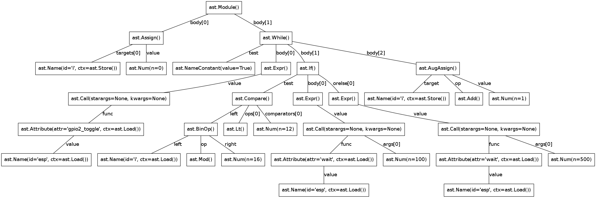
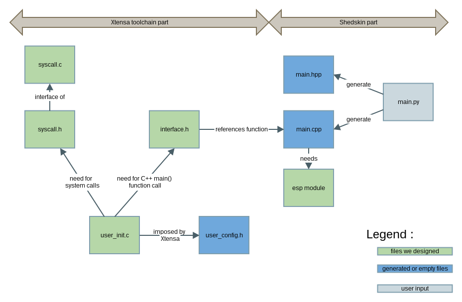

===============================
PYTHON on ESP8266: FINAL REPORT
===============================

--------------------------------
Luc Libralesso - Olivier Soldano
--------------------------------

.. contents:: Table of Contents
	:depth: 2

PREAMBLE: ROADMAP
=================

This project was a true challenge for us. To reach the point were we are at
we have been through many steps.
The objective of our project was to be able to run python programs on the ESP8266.
We had to understand how this chip works and how to communicate with it to be able to
put code on it later. 
Then we had to process python code which is interpreted, to create an executable of this code.
This part was partially treated by our predecessors that were in charge of doing the same porting
to STM32. they were using the shedskin and Xtensa cross compiler toolchain.
We had to addapt this toolchain to our chip and its associated sdk.

INTRODUCTION: Presenting the card and toolchain
===============================================

ESP8266 Core specs:
-------------------

The ESP is a very light piece of hardware with ultra low power consumption
(about 200 mA at full charge, making it ideal for IoT purposes), providing
WIFI capabilities and communicating by serial connection.
Here are some of the core specs of this cheap chip

	- 32-bit CPU running at 80MHz
	- 64ko of ROM for flashing programs
	- 64kb of RAM

These core specs were the most important subject of worying during our project.
In fact, it was the source of all our problems you will see why further in this report.
we will point out this weakness by comparing the ESP module with last year card.

Differences with stm32:
-----------------------

Last year, our predecessors worked on the same subject of providing a python
compiled library for the STM32F4 Discovery card wich is a lot more powerful than
the ESP8266. Here are the core specs of the 
	
	- 32-bit ARM Cortex-M4F core running at 200Mhz
	- 1 MB Flash
	- 192KB RAM
	
you can see it is much more beefy than our module. Particularly on the available ROM
making it possible to use bigger codes 

Shedskin:
---------

Shedskin is a python to C++ generator, allowing you to translate a subset
of python directly to C++, and to provide python interfaces that you personnally
code in C++ making you able to integrate them in the precedent subset.

Xtensa:
-------
Xtensa is a cross compiling toolchain making you able to process C/C++
into bytecode for the ESP 8266. it is based upon GCC.

FIRST STEPS: understanding the card and its environnement
=========================================================

To understand how the card is functionning, we tried at first to use its primary
purpose, namely a wifi access point.

First experiences with arduino:
-------------------------------

We used an arduino for the simplicity of its IDE, language, and serial interface
that can emulate multiple baud rates.
The arduino already uses its hardware serial connection to communicate
via usb (multiplexed on I/O 0 & 1), so we had to use another software emulated
serial line (*SoftwareSerial* function in arduino SDK).

The ESP module is commanded by sending ascii chains through the serial port.
The input voltage of the serial port is 3.3V, easily provided by the arduino pins.
Here are some examples of cammands and their effects on the module:

	- "OFF": shutdown the card
	- "SLEEP": puting the card in sleep mode
	- "WAKEUP": exitig sleep mode
	- "AT+CWLAP": asking for the detected wifi access points

getting rid of third party dev cards : UART connection.
-------------------------------------------------------

The ESP8266 is capable of using lots of serial connections, including
UART connections.

In order to connect directly to the ESP module, avoiding the third party
card solution, we thought to use a Serial to UART converter to use an USB
port to communicate with the module.
The solution is rather easy as many USB to serial converter are existing.
The problem is that they are probably providing too much voltage, as the
ESP8266 runs on 3,3V and the USB port is on 5V.
We where orientated toward making a reducer bridge for switching from 5V
to 3,3V to adapt a USB to RS232 plug that we were provided after asking 
for UART to USB converter. After making several measurements at the FABLab
we pointed out that the RS232 plug was providing 5V, and it will be to
much complicated to build a reducer beca
	

We asked for a FTDI converter module and were provided one in week 6. 

Flashing the card:
------------------

We have gone through a lot of issues due to lack of compatibility of the toolchain.
you can see all the details in our activity report week 4 to 6.

After resolving those problems and thanks to the direct connection we were able to "discuss" with
the chip. Thanks to the flash tool provided by the vendor in the SDK,
we were able to push code into the card from then on.

The ESP SDK:
------------

The ESP SDK is still a stutering pouch of non divulgated code, so we were
only able to catch some interfaces of the existing function calls with very
few examples on a stealthy forum of the ESP8266 builder (http://bbs.espressif.com/).
By the time we have written those lines the activity on this forum got 
creshendo and there was then an HDK, SDK, and APK for the wifi module.
And more importantly, some promices of publicity of their code realy soon;
the work of ingeneering on this chip will be much easier from now on!
 
 
Analysis of concurrent technologies
===================================

We have several ways to make applications on the ESP8266 :

 1 **C with Xtensa Toolchain :** A simple way to run programs on ESP8266.
   For it, we need to install the Xtensa Toolchain (we need to compile it on
   Linux, it takes nearly 30 min). Then, we can compile executables for ESP8266.
     
   Pro :
    - Simplest way known to run compiled programs on ESP8266
    
   Cons :
    - We need to use C language, it's not very user friendly !

 2 **Micropython framework :** Allows to program ESP8266 with a recent
   version of python (3.4).
   
   Pro :
    - Simple to install on a third party dev card communicating with the ESP8266
      and making it run programs
    
   Cons :
    - Lack of performance and uses a lot of memory space
    - It has not libraries to use wifi
    
   We can note that it's still in developpment, so we can hope that project
   will implement python on the ESP8266
 
 
 3 **Python to C++ via Shedskin :** Allows to program ESP8266 with python 2.7
   by compiling it to C++.
   
   Pro :
    - Coding with Python language (user friendly) and compiling C++ (performance)
    
   Cons :
    - It is working with a python subset
    - It has no libraries to use wifi
    - We need to use a garbage collector
 
 
 4 **NodeMCU :** A way to program ESP8266 with *Lua* language.
   
   Pro :
    - Coding with Lua language (user friendly) and has a great performance 
    
   Cons :
    - it's not python
  
  
C code with Xtensa toolchain only:
==================================

we put asside this solution directly as it was contrary to the spirit of
the project in its user friendly and futureproof parts.  
    
Interface with STM32 and micropython
====================================

After following the setup method descibed here: (https://github.com/micropython/micropython).
The STM32 was funtionning with micropython and an interactive shell was availale
on our computers to launch python commands on the ESP card.

NodeMCU & Lua
=============

The Lua language (in this case the eLua, embedded specialised version of Lua)
and nodeMCU platform is pretty advanced and light in term of code weight.
We easily put some code on the card thanks to the tutorial of the project
on github.

Shedskin
========

Shedskin is the cornerstone of our project, indeed it is the part that
makes us able to translate python to C++ making it compilable by the Xtensa
toolchain, we faced two problems using this technology in our use case.
Firstly the minimal library for using Shedskin is rather big compared to
the memory available in the ESP (it fullfils the memory just by being included),
and secondly we need to use a garbage collector to obtain the full fonctionnality
of python code (even if we can substract the garbage collector if our code
stays sufficiently compact in stack and heap).
But the more we tried to produce such short code, the more it conforted us
in the idea that this "python compiled" approach is not the good one to pick.
Indeed by the end of the project we faced the fact that any simple C++ library
is big compared to the chip's memory (for example even the list library is to big).

The garbage collection problem
==============================

Research on garbage collectors
------------------------------

One of the problems of compiling python to C++ is that whereas python,
C++ has no garbage collector (GC) and has to allocate (and deallocate) memory
manually.
Such problematics cannot be resolved throught compilation as the termination
problem isn't solvable - we can't decide when a variable won't be referenced
ever again just by 'reading' the source code - so we decided to search how to implement
a system of inbeded garbage collecting for our code.

We first reached the cheney algorithm in an idea of speed performance and a real time aproach.
This algorithm is a prototype of all the tracing algorithms we found further,
it consists in evaluating the memory links in the heap of the program,
when the heap does not references a zone anymore it automatically deallocate this zone.
The cheney algorithm works by splitting the free space in the stack into
two equal parts. The memory allocation begins in one of them, when it's 
nearly full or when the GC is forced, the GC evaluates the memory links
and when one is found a copy of the referenced memory zone is made to the
second part of the memory which is void. After evaluating all the current
stack, the active part is cleaned and the second becomes active. 
One advantage of this algorithm is that by copying the memory we can avoid
memory fragmentation but a substential amount of memory is needed in the 
first place.
With the ESP8266 we cannot afford this expense in memory as we only have
64kB of RAM and ROM inbound.

We do have to use another algorithm of garbage collecting if we want to use C++ **in fine**, 
but still a tracing algorithm, reference counting algorithms are not viable
for our project for the same memory reasons as the cheney algorithm 
(each object generates another of constant size). Moreover these algorithms
need atomicity.

The second problem we faced is the real time factor.
Indeed this platform has to manage real time actions such as any interuption
for garbage collecting will impact performance, and cause errors in transfers.

We stumbled upon a method of garbage collecting that does not necessitates
the interuption of activity, the *compile-time* garbage collecting.
we read a thesis on this subject adapted to the mercury language wich is
a pure declarative logical language.
This language is way more strict and hard to handle than python, and in the
scope of end user programing it is impossible to propose such a language.

Throughout this research, we asserted that we must find another way to handle the memory,
maybe by dropping the idea of using python and C++ and switch to another
language who will be able to generate code directly runable without garbage
collecting (Lua via nodemcu).

After discussing the subject with the project responsible we kept on
trying to implement python on the wifi module in spite of the limitations
we brought up with our analysis, for python is the most widespread.

The other option, create a specific python compiler toward C/C++.
=================================================================

we use The python parsing module to implement a python to C++ translator.
With this method, we can closely control what we add in the generated code.
We also choose to implement the python features we want to use in the generated
programs.

We also use the ASTOptimizer python package that makes some optimizations in
the AST to simplify output code.

	
	AST of our exemple python program
	
This part can translate the following python program :

.. code:: python

	i = 0
	while True:
		esp.gpio2_toggle()
		if i%16 < 10+2:
			esp.wait(100)
		else:
			esp.wait(500)
		i += 1

into the C++ program :

.. code:: c++

	#include <vector>
	#include "syscall.h"
	#include "interface.h"
	
	int main()
	{
	    int i = 0;
	    while (1) {
	        GPIO2_TOGGLE();
	        if (i % 16 < 12) {
	            WAIT(100);
	        } else {
	            WAIT(500);
	        }
	        i += 1;
	    }
	    return 0;
	}

We use the *indent* command to indent the output code. We used the 
following options : *indent -kr -nut -ts4*

APPENDIX
========

TYPICAL PROJECT ARCHITECTURE
----------------------------

	
	File architecture of our project
	

USEFUL LINKS
------------
	
-	technical monitoring & watch: (chip provider's forum, partly in chinese) http://bbs.espressif.com/ 
-	reStructuredText for the text layout (similar to Markdown) (http://docutils.sourceforge.net/rst.html)
-	Fritzing for the electronic schemes (http://fritzing.org/home/)
-	Bounding ESP8266 and arduino : http://www.seeedstudio.com/wiki/WiFi_Serial_Transceiver_Module
-	ESP8266 documentation : https://nurdspace.nl/ESP8266
-	example with a moisture sensor added : http://zeflo.com/2014/esp8266-weather-display/
-	Video tutorial for starting the ESP8266 : https://www.youtube.com/watch?v=9QZkCQSHnko
-	More info on micropython + STM32: https://github.com/pfalcon/esp-open-sdk
-	https://www.youtube.com/watch?v=qU76yWHeQuw
-	https://www.youtube.com/watch?v=uznq8W9sOKQ
-	http://www.instructables.com/id/Using-the-ESP8266-module/
-	http://hackaday.com/tag/esp8266/
-	ESP8266 Community Forum : https://github.com/esp8266
-	http://harizanov.com/2014/11/esp8266-powered-web-server-led-control-dht22-temperaturehumidity-sensor-reading/
-  http://gpio.kaltpost.de/?p=2082
-  https://en.wikipedia.org/wiki/Garbage_collection_%28computer_science%29
-  http://mercurylang.org/documentation/papers/CW2004_03_mazur.pdf
-  http://courses.cs.washington.edu/courses/csep521/07wi/prj/rick.pdf
-  http://spin.atomicobject.com/2014/09/03/visualizing-garbage-collection-algorithms/
-	http://rayshobby.net/first-impression-on-the-esp8266-serial-to-wifi-module/
-	https://www.youtube.com/watch?v=pWo-ErpVZC4
-	https://github.com/nodemcu/nodemcu-firmware
-	http://hackaday.com/2014/12/08/compiling-your-own-programs-for-the-esp8266/
-  http://41j.com/blog/2015/01/esp8266-writing-internal-flash-basic-keyvalue-store/
-  https://github.com/nekromant/esp8266-frankenstein
-  https://github.com/esp8266/esp8266-wiki/wiki/Memory-Map
-  https://github.com/esp8266/esp8266-wiki/wiki/Toolchain
-	(shedskin documentation) https://code.google.com/p/shedskin/wiki/docs
-  http://www.google.fr/url?sa=t&rct=j&q=&esrc=s&source=web&cd=2&cad=rja&uact=8&ved=0CCsQFjAB&url=http%3A%2F%2Fesp8266.ru%2Fdownload%2Fesp8266-doc%2FESP8266_IoT_SDK_Programming%2520Guide_v0.9.1.pdf&ei=PLLgVJPyHMn0UOe-guAH&usg=AFQjCNEIYfRg5wNXwpyPy6dE4JyJ3JXCTw&sig2=Bfd64QeuhP8WIyXGnVnZNA&bvm=bv.85970519,d.d24
-  https://github.com/nodemcu/nodemcu-firmware/wiki/nodemcu_api_en
-	https://github.com/leon-anavi/esp-hello-world : Link with a simple serial
-  https://pypi.python.org/pypi/astmonkey/0.1.1
-  https://bitbucket.org/haypo/astoptimizer
-  https://code.google.com/p/shedskin/wiki/docs#Compiling_a_Stand-Alone_Program
    

