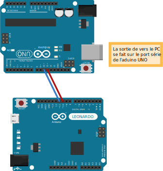

Semaine 1
=========

Présentation
------------

Dans cette semaine, nous nous intéressons à faire fonctionner la puce
*ESP8266* d'abord sur *arduino* pour bien comprendre son fonctionnement
avant de passer à la suite du projet.

Pour rappel : 

 - *arduino* permet un prototypage rapide de circuits électroniques et
   est programmable dans un langage très similaire à C.
 - *ESP8266* est une puce coûtant 3-4 euros permettant un accès wifi.
 

Un des problèmes est que pour s'assurer que la carte wifi fait ce qu'on 
attend d'elle, nous avons besoin d'une sortie de debug sur PC. Cependant,
elle utilise le port série de l'arduino et celui-là est déjà utilisé pour
la communication avec la carte. Nous devons donc passer par *SoftwareSerial*
qui nous donne la possibilité de faire une liaison série sur d'autres pins.

Nous utilisons un autre arduino pour faire le bridge, mais il aurait été tout
à fait possible d'utiliser un materiel comme *UartSBee v4* 
(http://www.seeedstudio.com/depot/UartSBee-V4-p-688.html)

Pour cela, nous réalisons **ArduinoSwitch** qui est un projet utilisant 
deux arduino : Un qui envoie en continu un flux d'information (simulation des
informations envoyées par la carte) et un qui est chargé de reçevoir ce flux
et l'envoyer sur le PC via le port série.

On note également que le baud rate doit être de 57.600 pour pouvoir communiquer
avec la carte. Cependant l'arduino ne dispose que d'un baudrate de 19.200 sur
*SoftwareSerial*. Il est donc nécessaire d'utiliser *Serial* pour communiquer avec 
la carte.

ArduinoSwitch
-------------

Nous réalisons le montage suivant :

	
	Dans ce montage, l'arduino LEONARDO envoie sur les pins 10 et 11
	des données à l'arduino UNO qui est programmé pour reçevoir les données sur
	ses pins 10 et 11 et les retransmettre sur son port série USB.

L'arduino LEONARDO a été programmé avec le code suivant :

.. code:: C

	#include <SoftwareSerial.h>
	
	// déclaration des pins de réception de donnée
	const int rxPin = 10;
	const int txPin = 11;
	
	SoftwareSerial bridge = SoftwareSerial(rxPin,txPin);
	
	void setup(){
	  bridge.begin(9600); 
	}
	
	void loop(){
	  bridge.write('a');
	  bridge.write('b');
	}

L'arduino UNO a été programmé avec le code suivant :

.. code:: C

	#include <SoftwareSerial.h>

	// déclaration des pins de réception de donnée
	const int rxPin = 10;
	const int txPin = 11;

	SoftwareSerial bridge = SoftwareSerial(rxPin,txPin);

	void setup(){
	  Serial.begin(9600);
	  bridge.begin(9600);
	}

	void loop(){
	  if ( bridge.available() ) // Si de l'information est disponible
		Serial.write(bridge.read()); // On lit les données sur le bridge et on écrit sur le serial
	}
	

Nous obtenons la sortie de l'arduino UNO suivante :
	
.. figure:: ressources/screen1.png
	:alt: screen du test de bridge avec un arduino
	
	On remarque bien que les caractères 'a' et 'b' arrivent sur le port série
	de l'ordinateur. Cela signifie que le bridge marche entre les deux arduino.
	On note que de temps en temps, certains 'a' et 'b' se suivent.

Communication avec le module wifi
---------------------------------

La configuration du module wifi se fait via une émission de texte sur le port
série. L'alimentation se fait en 3.3 V. Cela est facile à faire car l'arduino
dispose d'un pin 3.3V. Il est possible d'envoyer des signaux à cette carte pour
lui demander de s'éteindre (OFF), de se mettre en veille (SLEEP) ou de se rallumer
(WAKEUP).
Pour demander à la puce de lister l'ensemble des points d'accès wifi, on utilise
la chaîne : "AT+CWLAP".

Version avec 1 Arduino
----------------------

Sur cette page (http://zeflo.com/2014/esp8266-weather-display/), il est dit qu'il est possible de donner 
un baud rate sur autre qu'un port série plus important. Avec cette hyppothèse, nous
pouvons n'utiliser qu'un seul arduino pour communiquer avec la puce. 

Nous obtenons le code suivant :

.. code:: C

	#include <SoftwareSerial.h>

	// déclaration des pins de communication avec la puce
	const int rxPin = 10;
	const int txPin = 11;

	SoftwareSerial puce = SoftwareSerial(rxPin,txPin);

	void setup(){
	  Serial.begin(9600);
	  puce.begin(57600);
	  puce.println("AT+RST"); // Reset de la puce
	  puce.println("AT+CWLAP"); // Demande de scan des wifi
	}

	void loop(){
	  if ( puce.available() ){
		Serial.write(puce.read());
	  }  
	}

ressources et liens utilisés
----------------------------

Numéros sur les composants : carré : 
	ESP8266
	252014
	POHV54

Lors de cette semaine, nous avons utilisé les technologies suivantes :

 - *arduino* pour le prototypage 
 - *reStructuredText* pour la mise en page qui est similaire à *Markdown* (http://docutils.sourceforge.net/rst.html)
 - *Fritzing* pour la réalisation de schémas électroniques (http://fritzing.org/home/)
 
Et les liens suivants :
 
 - Utilisation du module wifi avec arduino : http://www.seeedstudio.com/wiki/WiFi_Serial_Transceiver_Module
 - Documentation du module wifi : https://nurdspace.nl/ESP8266
 - exemple avec un capteur d'humidité en plus : http://zeflo.com/2014/esp8266-weather-display/
 - Video youtube d'explications sur la marche à suivre pour demarrer avec la puce : https://www.youtube.com/watch?v=9QZkCQSHnko
 
Liens qui peuvent être intéressants :
 
 - https://www.youtube.com/watch?v=qU76yWHeQuw
 - https://www.youtube.com/watch?v=uznq8W9sOKQ
 - http://www.instructables.com/id/Using-the-ESP8266-module/
 - http://hackaday.com/tag/esp8266/
 - https://github.com/esp8266
 - http://harizanov.com/2014/11/esp8266-powered-web-server-led-control-dht22-temperaturehumidity-sensor-reading/
