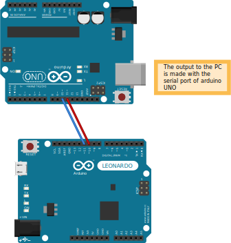
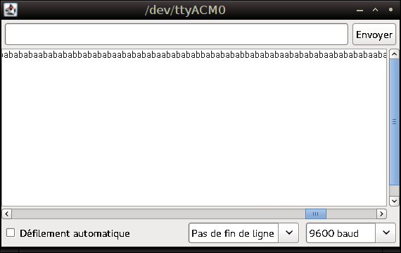

Week 1
======

Overview
--------

During this first week, we focused on running the *ESP8266* first on *arduino*
board to ensure we understand how the wifi module is functionning, before
going on with the project.

as a reminder:
	- *arduino* allows rapid prototyping of electronic circuits, and is
	  programable	by way of a language similar to C.
	- *ESP8266* is a chip costing 3-4€ allowing to use wifi protocols.

One of our problems is to ensure that the wifi card does what we demand,
means of a debuging output on our computer. However, the wifi card uses the
arduino serial port, wich is already used to communicate with the computer.
We have to use *SoftwareSerial* wich allows to emulate a serial link with
other pins.

We use another arduino board to create a bridge, but we could have used
a ready made card such as *UartSBee v4*
(http://www.seeedstudio.com/depot/UartSBee-V4-p-688.html)

to do so, we coded **ArduinoSwitch** a subproject using two arduinos: one
continuously streaming data (simulating informations sent by the ESP8266)
the other retreaving the stream and sending it to the conputer via usb.

we also noted that the baud rate has to be 57600 to be able to communicate
with the card. Arduino has a bad rate of 19200 on *SoftwareSerial*. it is
necessary to use *Serial* to communicate with the ESP8266

ArduinoSwitch
-------------

We are creating the following assembly :

	
	In this assembly, the arduino LEONARDO sends data to the UNO via pins
	10 and 11, who is set up to receive it on its 10 and 11 pins and transmits
	it via USB.

The code given to the arduino LEONARDO is the following :

.. code:: C

	#include <SoftwareSerial.h>
	
	// pins declaration
	const int rxPin = 10;
	const int txPin = 11;
	
	SoftwareSerial bridge = SoftwareSerial(rxPin,txPin);
	
	void setup(){
	  bridge.begin(9600); 
	}
	
	void loop(){
	  bridge.write('a');
	  bridge.write('b');
	}

The code given to the arduino ONU is the following :

.. code:: C

	#include <SoftwareSerial.h>

	// pins declaration
	const int rxPin = 10;
	const int txPin = 11;

	SoftwareSerial bridge = SoftwareSerial(rxPin,txPin);

	void setup(){
	  Serial.begin(9600);
	  bridge.begin(9600);
	}

	void loop(){
	  if ( bridge.available() ) 		// if there is data on the bridge
		Serial.write(bridge.read()); 	// we read it and send it to the serial
	}
	
We are getting the following output from the UNO :
	

	
	We are catching 'ab' sequences on the USB serial, meaning that the bridge
	is functional.
	We have some errors on transmition but not very significative for our
	assembly is relatively unstable (old cables, no insulation board, etc...).

Communicate with the wifi module
--------------------------------

The wifi module setup is made by sending ascii strings on it's serial port.
The power supply intput is 3.3V, easy to provide via the arduino 3.3V pin.
We give some examples of signals understandable by the card:

	- "OFF": shutdown the card
	- "SLEEP": puting the card in sleep mode
	- "WAKEUP": exitig sleep mode
	- "AT+CWLAP": asking for the detected wif i access points

Single arduino version
----------------------

On this page (http://zeflo.com/2014/esp8266-weather-display/), it is said 
that it is possible to give a higher baud rate on a *SoftwareSerial*.
Given this hypothesis, we are able to use a single arduino instead of two.  

Obtained code :

.. code:: C

	#include <SoftwareSerial.h>

	// communication pins with the ESP8266
	const int rxPin = 10;
	const int txPin = 11;

	SoftwareSerial puce = SoftwareSerial(rxPin,txPin);

	void setup(){
	  Serial.begin(9600);
	  puce.begin(57600);
	  puce.println("AT+RST"); // Reset the module
	  puce.println("AT+CWLAP"); // wifi scan demand
	}

	void loop(){
	  if ( puce.available() ){
		Serial.write(puce.read());
	  }  
	}

Ressources and links used
-------------------------

Numbers on the ESP8266 chips : 
	ESP8266
	252014
	POHV54

During this week, we used the following technologies :

 - *arduino* for prototyping 
 - *reStructuredText* for the text layout (similar to *Markdown*) (http://docutils.sourceforge.net/rst.html)
 - *Fritzing* for the electronic schemes (http://fritzing.org/home/)

And the following links :
 
 - bounding ESP8266 and arduino : http://www.seeedstudio.com/wiki/WiFi_Serial_Transceiver_Module
 - ESP8266 documentation : https://nurdspace.nl/ESP8266
 - example with a moisture senso added : http://zeflo.com/2014/esp8266-weather-display/
 - Video tutorial for starting the ESP8266 : https://www.youtube.com/watch?v=9QZkCQSHnko
 
useful links :
 
 - https://www.youtube.com/watch?v=qU76yWHeQuw
 - https://www.youtube.com/watch?v=uznq8W9sOKQ
 - http://www.instructables.com/id/Using-the-ESP8266-module/
 - http://hackaday.com/tag/esp8266/
 - https://github.com/esp8266
 - http://harizanov.com/2014/11/esp8266-powered-web-server-led-control-dht22-temperaturehumidity-sensor-reading/
