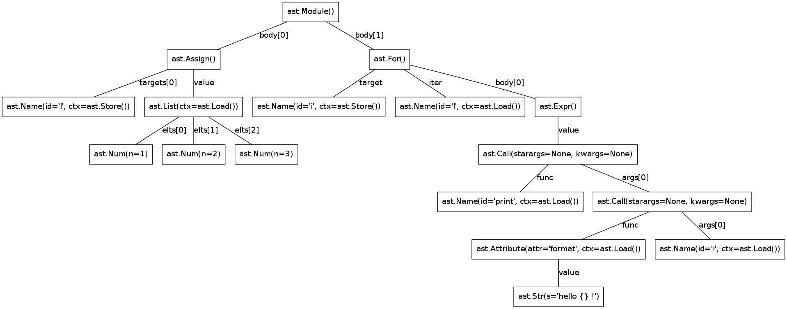

In the previous week we had problems with shedskin. It have a 
strong dependance of the garbage collector and other python libraries.

It's problematic because it's to heavy to run on the ESP8266.

Some ways are possible :

- Making C/C++ modules that do nothing to replace calls to the garbage
  collector

- Implement an another Python to C++ compiler that runs a subset of python
  and translates it to c++

Python AST module
=================

With the python AST module, it's possible to parse and generate the Abstract
Syntax Tree of the input python program.

In our tests, we will work with the following python program :

.. code-block:: python

	l = [1,2,3]
	for i in l:
		print("hello {} !".format(i))

We can display the AST with the following code :

.. code-block:: python

	import ast

	def parseprint(code, filename="<string>", mode="exec", **kwargs):
		"""Parse some code from a string and pretty-print it."""
		node = ast.parse(code, mode=mode) # An ode to the code
		print(ast.dump(node, **kwargs))

	source = """
	l = [1,2,3]
	for i in l:
		print("hello {} !".format(i))
	"""
	parseprint(source)

.. parsed-literal::
	Module(body=[Assign(targets=[Name(id='l', ctx=Store())], 
	value=List(elts=[Num(n=1), Num(n=2), Num(n=3)], ctx=Load())), 
	For(target=Name(id='i', ctx=Store()), iter=Name(id='l', ctx=Load()), 
	body=[Expr(value=Call(func=Name(id='print', ctx=Load()), 
	args=[Call(func=Attribute(value=Str(s='hello {} !'), 
	attr='format', ctx=Load()), args=[Name(id='i', ctx=Load())], 
	keywords=[], starargs=None, kwargs=None)], keywords=[], 
	starargs=None, kwargs=None))], orelse=[])])

With the module *astmonkey* , it's possible to generate a graphical tree
of parsing. 

The following code will generate the graphical AST :

.. code-block:: python

	from astmonkey import visitors, transformers
	
	source = """
	l = [1,2,3]
	for i in l:
		print("hello {} !".format(i))
	"""

	node = ast.parse(source)
	node = transformers.ParentNodeTransformer().visit(node)
	visitor = visitors.GraphNodeVisitor()
	visitor.visit(node)

	visitor.graph.write_png('graph.png')

We get the following output :

	Graphical output of the AST for the example program.
	

Now, we have a AST, it's possible to make some optimisations (with the *AST Optimizer* project),
That returns an equivalent AST that is optimized.

The next step is to make an interpreter that reads the AST and generate C++
code. If we continue on the C++ generation path, we can begin by adding
some native types in C++ like integers, Strings and lists because they
are widely used in python.

With this, we can make some python modules and python primitives to 
run the ESP features in python.

It will be a very restricted subset of python, therefore, it will be simple
and it will be possible to add some features in the future versions of the project.

Useful Links
============

- https://bitbucket.org/haypo/astoptimizer
