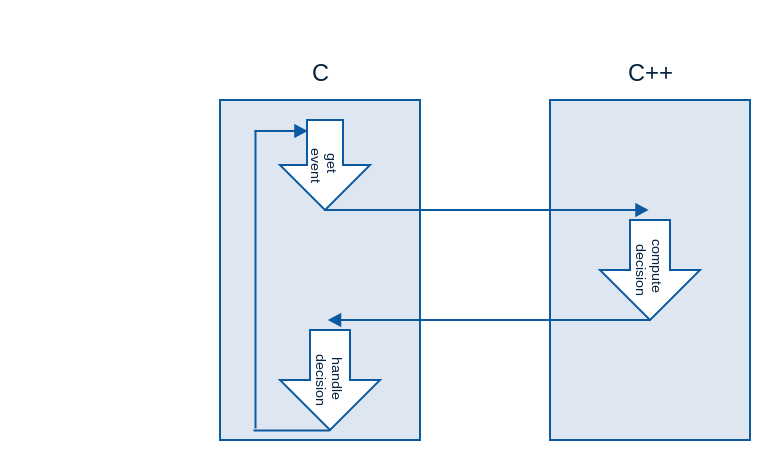

In this week we will focus on making C++ work on the ESP8266.

We have two ways for doing that :

- changing the toolchain to integrate the SDK in C++. But it can be pretty
  hard because the SDK is not designed for C++.
- Making a decision module in C++ called in a C code. This ways is more 
  complex but allows to compile C++ sources separately from the SDK.
  
We will implement the second option.

Architecture
============

In this way, we can easily add new modules in C++ simply by adding
new events and new result handlers in C.

How to integrate a C++ module
=============================

In this section, we will make a simple C++ module that allows the LED blinking
at different speeds.

First of all, we define the following interface (C header file).

..code:: C

	#ifndef __INTERFACE_H__
	#define __INTERFACE_H__

	#ifdef __cplusplus
	extern "C" {
	#endif

		#define LOW_SPEED 1000
		#define HIGH_SPEED 100
		#define CYCLE_VALUE 8

		int blinkTimer();

	#ifdef __cplusplus
	}
	#endif

	#endif

We use #ifdef __cplusplus to add extern "C" if the file is compiled in C++
and do nothing if the file is compiled in C. 

We make the following C++ source :

..code:: C++

	#include "interface.h"

	int i = 0;

	int blinkTimer(){
		if ( i < CYCLE_VALUE ){
			i++;
			return HIGH_SPEED;
		} else if ( i == CYCLE_VALUE ){
			i++;
			return LOW_SPEED;
		} else {
			i = 0;
			return LOW_SPEED;
		}
	}

We use the C++ function in the following C snippet :

..code:: C

	#include "interface.h"

	void some_timerfunc(void *arg)
	{
		//Do blinky stuff
		if (GPIO_REG_READ(GPIO_OUT_ADDRESS) & BIT2)
		{
			//Set GPIO2 to LOW
			gpio_output_set(0, BIT2, BIT2, 0);
		}
		else
		{
			//Set GPIO2 to HIGH
			gpio_output_set(BIT2, 0, BIT2, 0);
		}

		os_timer_arm(&some_timer, blinkTimer(), 0);	
	}

In this way, we select the time when the next call to some_timerfunc.
